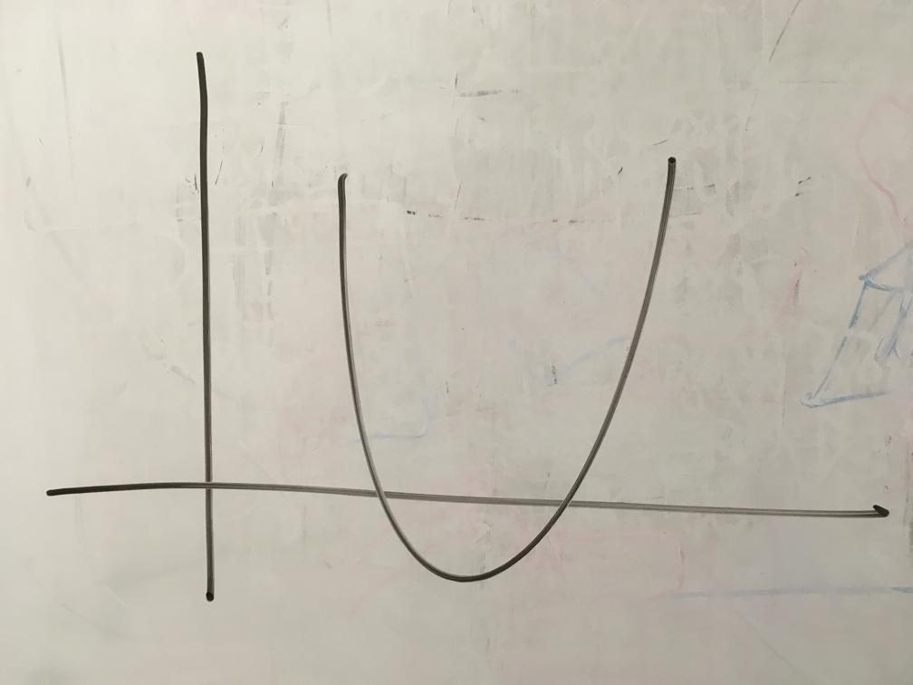
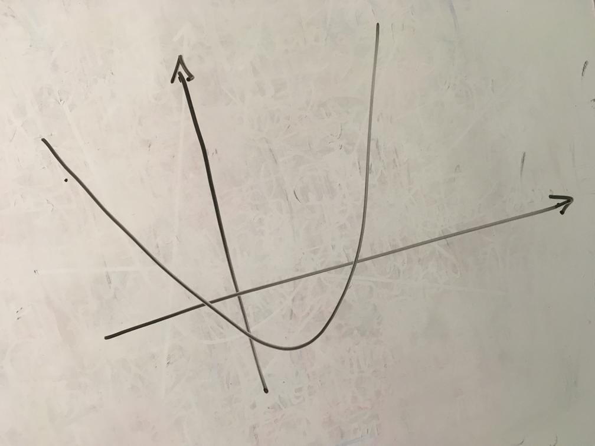

# parabola_detector

A parabola detector using Python3 with opencv and numpy. The goal is to read an image of a hand drawn parabola on a white board and find out the equation that better fits that given parabola.

Example input images:  
  

The steps taken:  
* Turn the image into grey-scale and apply k-means (starting centroids at black and white) to separate back from foregound.
* Apply a dilation, because in some images the strokes were too thin.
* So far we have:  
  
* Apply OpenCV's Hough transform to find the 2 lines representing the X and Y axes. Here the Hough transform will return many many lines (yellow in the image) - due to the thickness of the strokes - and we need to select the 2 most perpendicular ones. We select the line with the lowest angle as Axis 1 (red), then we look for the one that form the angle closest to 90° with Axis 1, that will be Axis2 (blue). To have a perfect perpendicular pair of axes, we take the intersection between Axis 1 and 2 and create another axis that's 90° with Axis 1 and crosses that intersection, that will be Axis Y (pink) and Axis 1 is Axis Y (still red).
* All the lines returned:  
  
* Use Axis 1 and 2 (red and blue earlier) to remove those lines from out segmented image, leaving it only with the parabola points (and some noise).
* Now it looks like this:  
  
* Apply RANSAC to find a parabola equation in the form of ax² + bx + c = y that best fits our parabola points. Quickly how that done: rotate the ramaining points to be horizontally alligned with the image, using Axis X; randomly select 3 points that will for a linear system Ax = B; solve that system using transpose method (At Ax = At B), that gives us our parabola equation to those 3 points; check how many points fit to that parabola, if too many outlier go back and select new points; otherwise we fit a new equation with all inliers; calculate the total error to that equation; repeat N times (100) and select the parabola that fits the points with the least error; rotate the point back to be alligned with Axis X.
* Final results:  
  
